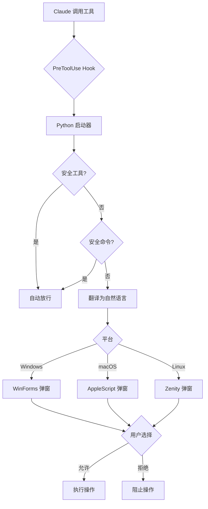

# Chinese Permission Popup 中文权限确认

## 核心功能

当 Claude Code 准备执行**危险操作**时，弹出**中文自然语言**确认窗口：

- ❌ 不显示：`rm /tmp/test.txt`
- ✅ 显示：**删除文件/目录：/tmp/test.txt**

安全命令（`ls`、`cat`、`git`、`npm` 等 80+ 个）**自动放行不弹窗**。

## 安装

### Windows
```powershell
cd chinese-permission
.\install.ps1
```

### macOS / Linux
```bash
cd chinese-permission
chmod +x install.sh && ./install.sh
```

### 安装后
重启 Claude Code 会话即可生效。

## 工作流



## 触发弹窗的操作

| 操作 | 自然语言示例 |
|------|------------|
| `rm /tmp/test.txt` | 删除文件/目录：/tmp/test.txt |
| `rm -rf /tmp/build/` | 强制递归删除：/tmp/build/ |
| `del /f file.txt` | 强制删除文件：/f file.txt |
| `Remove-Item -Recurse dir/` | 强制删除项目：-Recurse dir/ |
| `Write(...)` | 写入文件：/path/to/file.ts |
| `Edit(...)` | 编辑文件：/path/to/file.ts - 替换「old code...」 |
| `mv /tmp/a /tmp/b` | 移动/重命名：/tmp/a /tmp/b |

## 自动放行的安全命令

`echo` `ls` `cat` `head` `tail` `git` `grep` `find` `node` `npm` `npx` `pnpm`
`python` `python3` `pip` `go` `cargo` `make` `docker` `kubectl` `ps` `date`
`curl` `wget` `cp` `mkdir` `tar` `zip` `unzip` `chmod` `printf` `mv` ……

完整列表见 `scripts/pretool_launcher.py` 中的 `SAFE_COMMANDS`。

## 文件结构

```
chinese-permission/
├── SKILL.md                        ← 本文件
├── README.md                       ← 人类阅读文档
├── install.sh                      ← Unix 安装脚本
├── install.ps1                     ← Windows 安装脚本
└── scripts/
    ├── pretool_launcher.py         ← 跨平台启动器（核心）
    └── popups/
        └── dialog_win.ps1          ← Windows WinForms 弹窗
```

> macOS / Linux 弹窗逻辑内嵌在 `pretool_launcher.py` 中，利用系统内置工具（osascript / zenity），无需额外脚本。

## 依赖

| 平台 | 依赖 | 安装方式 |
|------|------|---------|
| **Windows** | Python 3.6+、PowerShell (内置) | `winget install python` |
| **macOS** | Python 3.6+、osascript (内置) | 系统自带 |
| **Linux** | Python 3.6+、zenity 或 kdialog (通常预装) | `apt install zenity` |

## 配置说明

安装脚本会自动完成以下配置：

### settings.json → PreToolUse hook
```json
{
  "hooks": {
    "PreToolUse": [
      {
        "matcher": "",
        "hooks": [
          {
            "type": "command",
            "command": "python3 ~/.claude/skills/chinese-permission/scripts/pretool_launcher.py",
            "timeout": 120
          }
        ]
      }
    ]
  }
}
```

### settings.local.json → 危险命令白名单

将 `rm`、`del`、`Remove-Item` 等加入 `allow` 列表，让 PreToolUse hook 成为**唯一确认入口**（绕过英文终端对话）。

## 工作原理

1. **PreToolUse Hook** 在 Claude Code 每次工具调用前触发
2. Hook 将工具信息（JSON）通过 stdin 传给 `pretool_launcher.py`
3. Python 脚本判断是否需要确认
4. 危险操作 → 弹出平台原生对话框（用户点允许/拒绝）
5. 结果返回给 Claude Code → 执行或阻止

## 个性化

- 修改 `SAFE_COMMANDS` 集合增减自动放行的命令
- 修改 `translate()` 函数自定义自然语言描述
- 修改 `dialog_win.ps1` 自定义 Windows 弹窗外观

## 许可证

MIT
